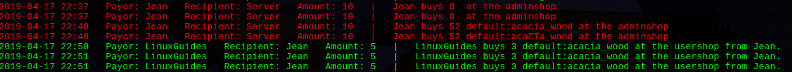

# Minetest Mod: Jean's Economy

https://github.com/Jean28518/jeans_economy

## Features:
- Keep track of your economy on the server by listing all transactions your players made (with timestamps) (even individually), or by listing the balances of the players.
- Individual bank statements for players.
- Handles transactions between players with automatic checks and database filling. (Modders have to implement only one single line for that.)
- Fully automated database cleaning, which can also be adjusted.
- Other useful commands such as `/pay`, `/money`, or `/money_give`.
- Daily Rewards, for when a player joins the server.
- Frequent Rewards, for all currently online players.
- Optional, complete support for the atm mod https://forum.minetest.net/viewtopic.php?t=15029.
- Easy integration into server ecosystems.

## Commands:
`/money <player>` See the current balance of `<player>`. The default is the player itself.

`/pay <player> <amount> <description>` Pay another player some money.

`/transactions <count> <player>` Get the last `<count>` transactions of `<player>`. The default is 10, and the player is itself. You need the `economy` privilege if you want to see the bank statements of other players. Press F10 to get a better overview of your bank statements.

`/balances <min_balance>` List all player accounts whose balances are above the limit. The default is 0. You need the `economy` privilege for that.

`/server_transactions <count>` Get the last `<count>` transactions of the whole server. The default is 25. You need the `economy` privilege for that.

`/money_give <player> <amount>` Give a player some money. You need the `economy` privilege for that. You can also type in a negative amount; then, the money will be removed from the account.

`/economy_sync_from_atm` Sync all ATM accounts to the jeans_economy database. This is needed if you want to remove the atm mod from your server.

## Configuration:
All configurations are found in the config.lua file. You can configure:
- The database size (detailed transactions).
- The Frequency Payout (activated, period, amount per player).
- The Daily Rewards (activated, award per every single day).

## Privileges:
The mod comes with a privilege called `economy`. Any player with the `economy` privilege can see all transactions of every player and can also "cheat" money! Just give that privilege to admins.

## Coexistence with ATM Mod:
As long as the ATM mod is active on the server, Jeans Economy uses the ATM accounts. If you want to remove the atm mod from your server, you can sync the accounts from the atm to the jeans_economy database with `/economy_sync_from_atm`. If you don't have the atm mod, everything is fine, too.

## Coexistence with other economy Mods:
If you have another economy mod on your server but want that jeans_economy works with this mod too, you just have to change the following functions in the accounts.lua file:
- `function jeans_economy.set_account(player_name, value)`
- `function jeans_economy.get_account(player_name)`
- `function jeans_economy.get_accounts_array()`

## For Modders:
To use this mod, you have to implement one of the following lines into your code.
- `jeans_economy.book(payor_name, recipient_name, amount, description)` This function checks if the payor has enough money, performs the transaction between these players (using atm accounts), and saves this transaction to the database. It returns `true` if the transaction was successfully done; otherwise, it returns `false`.
- `jeans_economy.get_account(player_name)` Returns the balance of the player. If you only want to check with this function whether the player has enough money to do something or not, you can use `jeans_economy.book` instead.
- `jeans_economy.get_accounts_array()` Returns all accounts of the server in an array. The array has the following format: `{["Player1"] = 300, ["Player2"] = 12450, ["Player3"] = 10,}`
- The server also has an unlimited bank account. It is called `!SERVER!`.
- There are other functions in the code you could use, but it would be good if you just restrict yourself to the functions above.

**Please insert only characters (a-z and A-Z) and numbers (0-9) into the inputs!**

### Example:
`if jeans_economy_book("Player1", "Player2", 500, "Bought 10 Diamonds") then -- give diamonds else -- Player1 doesn't have enough money!`

## Screenshot of `/transactions`:

## Feedback?
If you have found bugs or have some ideas, let me know in the GitHub issues section!
